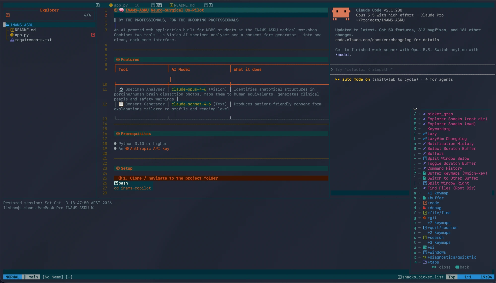

# VimCode

A Neovim setup built on [LazyVim](https://lazyvim.org), tuned for Python, Jupyter notebooks and working alongside Claude Code.



- **Look:** solarized-osaka with a dark background, slanted bufferline tabs with diagnostics, lualine statusline with clock
- **Notebooks:** run Jupyter cells in the buffer (molten), inline plots in Kitty, WezTerm or Ghostty (image.nvim), `.ipynb` opened as markdown (jupytext)
- **Python:** pyright + ruff language servers, ipython REPL (iron.nvim)
- **Terminals:** three toggleable bottom terminals and a Claude Code side panel

VimCode installs as its own Neovim app (`NVIM_APPNAME=vimcode`) and is started with the `vimcode` command, so any existing Neovim config is left alone.

## Install on macOS

### 1. Prerequisites

With [Homebrew](https://brew.sh):

```bash
xcode-select --install
brew install neovim git ripgrep fd node
brew install --cask font-jetbrains-mono-nerd-font
```

Then set **JetBrainsMono Nerd Font** as the font in your terminal's settings, otherwise icons show up as boxes.

`xcode-select` provides the C compiler used to build syntax highlighting. Skip it if Xcode or its command line tools are already installed.

### 2. Install VimCode

One command:

```bash
curl -fsSL https://raw.githubusercontent.com/lisbangonsalves/VimCode/main/install.sh | bash
```

Or clone it and install from the clone (edits in the clone take effect directly):

```bash
git clone https://github.com/lisbangonsalves/VimCode.git
cd VimCode && ./install.sh
```

The installer puts the config in `~/.config/vimcode`, adds a `vimcode` command to `~/.local/bin`, installs the plugins at the pinned versions and lists any optional tools you're missing. If it says `~/.local/bin` isn't on your PATH, run the line it prints and open a new terminal.

The first install may print an "Unmet requirements for nvim-treesitter" warning. It's a one-off: the missing `tree-sitter` tool is downloaded automatically during that run.

### 3. Run it

```bash
vimcode
```

### Optional extras (macOS)

| For | Install |
|-----|---------|
| Inline plots | `brew install imagemagick`, and use [Kitty](https://sw.kovidgoyal.net/kitty/), [WezTerm](https://wezterm.org) or [Ghostty](https://ghostty.org) as your terminal |
| Notebooks and REPL | `pip3 install pynvim jupyter_client ipython jupytext` |
| Claude Code panel | [Claude Code](https://claude.com/claude-code) (`claude` on your PATH) |

Linux works the same way: install the prerequisites with your package manager and run the same install command. Make sure your Neovim is 0.11.2 or newer; some distributions ship older versions.

## Install on Windows

The install script is for macOS and Linux, so on Windows the setup is a few PowerShell commands. Use [Windows Terminal](https://aka.ms/terminal) or [WezTerm](https://wezterm.org).

### 1. Prerequisites

In PowerShell:

```powershell
"Neovim.Neovim", "Git.Git", "BurntSushi.ripgrep.MSVC", "sharkdp.fd", "OpenJS.NodeJS.LTS", "zig.zig" | ForEach-Object { winget install -e --id $_ }
```

Close and reopen PowerShell so the new tools are on your PATH. `zig` is the C compiler used to build syntax highlighting.

Then download a font from [nerdfonts.com](https://www.nerdfonts.com/font-downloads) (for example JetBrainsMono), install it (right-click the `.ttf` files and choose Install), and select it in your terminal's settings.

### 2. Install VimCode

```powershell
git clone https://github.com/lisbangonsalves/VimCode.git "$env:LOCALAPPDATA\vimcode"
```

Add a `vimcode` command to your PowerShell profile:

```powershell
if (!(Test-Path $PROFILE)) { New-Item -ItemType File -Path $PROFILE -Force | Out-Null }
Add-Content $PROFILE 'function vimcode { $env:NVIM_APPNAME = "vimcode"; try { nvim @args } finally { Remove-Item Env:NVIM_APPNAME } }'
. $PROFILE
```

If PowerShell says running scripts is disabled, allow your own profile to run with `Set-ExecutionPolicy -Scope CurrentUser RemoteSigned`, then run `. $PROFILE` again.

### 3. Run it

```powershell
vimcode
```

The first launch downloads and installs all the plugins, which takes a minute. When it finishes, run `:Lazy restore` inside VimCode to switch every plugin to the tested versions in `lazy-lock.json`, then restart VimCode.

### Optional extras (Windows)

| For | Install |
|-----|---------|
| Inline plots | `winget install -e --id ImageMagick.ImageMagick`, and use [WezTerm](https://wezterm.org) (Windows Terminal can't display them) |
| Notebooks and REPL | `winget install -e --id Python.Python.3.12`, then `py -m pip install pynvim jupyter_client ipython jupytext` |
| Claude Code panel | [Claude Code](https://claude.com/claude-code) (`claude` on your PATH) |

Prefer a Linux environment? Inside [WSL](https://learn.microsoft.com/windows/wsl/install), follow the macOS/Linux steps with your distribution's package manager instead of Homebrew.

## Keymaps

`<leader>` is Space. Everything else is [LazyVim's defaults](https://lazyvim.org/keymaps).

| Keys | Action |
|------|--------|
| `<leader>e` | Toggle the file explorer |
| `<leader><space>` / `<leader>/` | Find a file by name / search text in the project |
| `Ctrl-h` / `j` / `k` / `l` | Move between windows |
| `Ctrl-/` | Toggle a terminal (`Ctrl-k` jumps back up to your file) |
| `<leader>ac` | Toggle Claude Code panel |
| `<leader>t1` / `t2` / `t3` | Toggle bottom terminal 1 / 2 / 3 |
| `<leader>mi` | Start a Jupyter kernel |
| `<leader>ml` / `me` / `mv` | Run line / motion / visual selection |
| `<leader>mr` / `mc` | Re-run cell / all cells |
| `<leader>mh` / `md` | Hide output / delete cell |
| `<leader>rl` / `rc` | Send line / motion to the ipython REPL |

## Update

**macOS / Linux:** re-run the install command (or `git pull` in your clone).

**Windows:**

```powershell
git -C "$env:LOCALAPPDATA\vimcode" pull
```

Then run `:Lazy restore` inside VimCode.

## Uninstall

**macOS / Linux:**

```bash
rm -rf ~/.config/vimcode ~/.local/share/vimcode ~/.local/state/vimcode ~/.cache/vimcode ~/.local/bin/vimcode
```

**Windows:**

```powershell
Remove-Item -Recurse -Force "$env:LOCALAPPDATA\vimcode", "$env:LOCALAPPDATA\vimcode-data"
```

Then delete the `function vimcode` line from your profile (`notepad $PROFILE`).

## License

Apache-2.0, inherited from the [LazyVim starter](https://github.com/LazyVim/starter).
